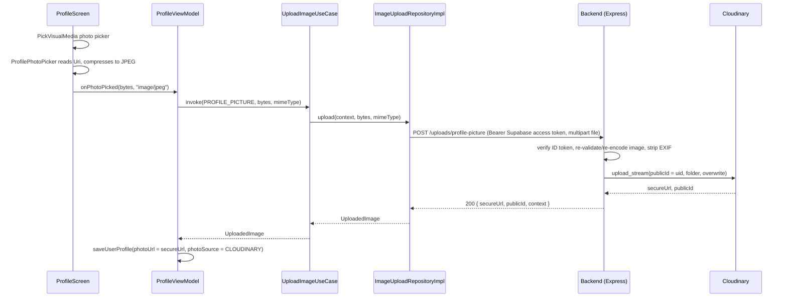

# Haztrack — Developer Documentation

> **Current state:** Supabase authentication + editable user profile stored on the self-hosted backend (with secure Cloudinary photo uploads via that same backend). The full hazard-tracking product domain has not been implemented yet. The remaining placeholder packages (`data/local`, `data/service`, `presentation/common`) are empty and reserved for future features. Firebase is not used.
>
> **Getting started:** clone, secrets, and a feature summary live in the root [`README.md`](../README.md). Contact the main developer for `SUPABASE_URL` / `SUPABASE_ANON_KEY`, the team `google-services.json` (OAuth web client id only), and other secrets — do not create a separate Supabase or Firebase project for local work.

---

## Table of Contents

1. [What Is This App?](#1-what-is-this-app)
2. [Tech Stack](#2-tech-stack)
3. [Project File Structure](#3-project-file-structure)
4. [Understanding MVVM (For Beginners)](#4-understanding-mvvm-for-beginners)
5. [Architecture Layers Explained](#5-architecture-layers-explained)
   - [Data Layer](#51-data-layer)
   - [Domain Layer](#52-domain-layer)
   - [Presentation Layer](#53-presentation-layer)
6. [Dependency Injection with Hilt](#6-dependency-injection-with-hilt)
7. [Navigation](#7-navigation)
8. [Authentication Features](#8-authentication-features)
    - [Email Authentication](#81-email-authentication)
   - [Google Sign-In](#82-google-sign-in)
   - [Password Reset](#83-password-reset)
   - [Session Persistence](#84-session-persistence)
   - [Sign Out](#85-sign-out)
   - [User Profile](#86-user-profile)
   - [Editable Profile Fields and Secure Photo Uploads](#87-editable-profile-fields-and-secure-photo-uploads)
9. [UI Components](#9-ui-components)
10. [Error Handling](#10-error-handling)
11. [Build, Lint, and Code Quality](#11-build-lint-and-code-quality)
12. [Setting Up Locally](#12-setting-up-locally)
13. [Password-Reset Deep Links](deeplinks-password-reset.md)
14. [Backend Image Upload Specification](backend-image-upload-spec.md)

---

## 1. What Is This App?

**Haztrack** (`com.danger.haztrack`) is an Android application intended for hazardous-material tracking. The current version implements a complete, production-quality authentication system as the foundation for the rest of the product.

**Implemented screens:**

| Screen | Route | Description |
|---|---|---|
| Login | `login` | Email/password + Google Sign-In |
| Register | `register` | Create account with email/password (first name, last name, email, password) |
| Forgot Password | `forgot_password` | Send a password-reset email |
| Reset Password | `reset_password/{email}` | Establish a Supabase recovery session from the deep link and set a new password |
| Home | `home` | Post-sign-in dashboard: greets the user and links to Report/My Reports |
| Report | `report` | Placeholder for the hazard-reporting flow (opened from the FAB or Home) |
| My Reports | `my_reports` | Placeholder list of the signed-in user's hazard reports |
| Notifications | `notifications` | Placeholder for hazard alerts and app notifications |
| Settings | `settings` | Signed-in user info (tap to open Profile) and Sign Out |
| Profile | `profile` | View and edit the signed-in user's first name, last name, date of birth, gender, phone number, email (read-only), and profile picture |

`Home`, `Report`, `My Reports`, `Notifications`, and `Settings` are the 5 tabs of the post-login navigation shell — see [Section 7](#7-navigation). `Report`, `My Reports`, and `Notifications` currently show only an empty-state message; there is no report/notification data source yet. `Profile` is opened from Settings and is not a bottom-nav tab (no `MainScaffold`), matching the pattern used by `ForgotPassword`/`ResetPassword`.

---

## 2. Tech Stack

| Category | Library / Tool | Version |
|---|---|---|
| Language | Kotlin | 2.2.10 |
| UI | Jetpack Compose + Material 3 | BOM 2024.09.00 |
| Architecture | MVVM | — |
| Navigation | Navigation Compose | 2.10.0 |
| Dependency Injection | Hilt | 2.60.1 |
| Authentication | Supabase Auth Kotlin | 3.8.0 |
| User profile storage | Self-hosted REST `GET`/`PUT` `/users/me` | — |
| Google Sign-In | AndroidX Credentials + Google Identity | 1.6.0 / 1.2.0 |
| Coroutines | Kotlin Coroutines + Play Services adapter | 1.11.0 |
| Image loading | Coil (`coil-compose`, `coil-network-okhttp`) | 3.6.0 |
| Backend REST calls | Retrofit + Moshi converter | 3.0.0 |
| JSON serialization | Moshi (`moshi-kotlin-codegen` via KSP) | 1.15.2 |
| HTTP client | OkHttp + `logging-interceptor` (debug-only logging) | 5.5.0 |
| Supabase HTTP client | Ktor Android | 3.5.2 |
| Phone number validation | `libphonenumber-android` (io.michaelrocks) | 9.0.36 |
| Logging | Timber (`DebugTree` planted in debug builds) | 5.0.1 |
| Static Analysis | Detekt | 2.0.0-alpha.6 |
| Build | Gradle (Kotlin DSL) | 9.3.1 wrapper |
| Min SDK | Android 7.0 (Nougat) | API 24 |
| Target SDK | Android 16 | API 36 |

Dependencies are managed centrally in `gradle/libs.versions.toml` using Gradle's **Version Catalog** — one source of truth for all versions. You never hardcode version numbers in individual `build.gradle.kts` files.

---

## 3. Project File Structure

```
haztrack/
├── build.gradle.kts                    # Root Gradle: applies plugins, does NOT declare dependencies
├── settings.gradle.kts                 # Registers the :app module; configures repositories
├── gradle/
│   ├── libs.versions.toml              # Version catalog: all dependency/plugin versions in one file
│   └── wrapper/gradle-wrapper.properties
├── config/detekt/detekt.yml            # Detekt static analysis rules
├── .githooks/
│   ├── pre-commit                      # Runs lint/detekt before every commit
│   └── commit-msg                      # Enforces commit message format
└── app/
    ├── build.gradle.kts                # App module: plugins, android{}, dependencies
    ├── google-services.json            # OAuth web client id for Google Sign-In — GITIGNORED
    ├── proguard-rules.pro
    └── src/main/
        ├── AndroidManifest.xml         # App entry point, permissions, activity declarations
        ├── res/
        │   ├── values/strings.xml      # ALL user-facing text lives here (no hardcoded strings)
        │   ├── values/themes.xml       # App theme (no action bar)
        │   ├── drawable/
        │   │   ├── ic_app_logo.png     # Login screen branding image
        │   │   └── ic_google.xml       # Google logo vector
        │   └── mipmap-*/               # Launcher icons (multiple densities)
        └── java/com/danger/haztrack/
            ├── HaztrackApplication.kt  # @HiltAndroidApp — Hilt entry point; plants Timber.DebugTree in debug
            ├── MainActivity.kt         # @AndroidEntryPoint — single Activity, hosts Compose
            │
            ├── di/                     # Dependency Injection (Hilt modules)
            │   ├── SupabaseModule.kt   # Provides SupabaseClient + Auth plugin
            │   ├── RepositoryModule.kt # Binds *RepositoryImpl → their domain interfaces
            │   ├── NetworkModule.kt    # Retrofit + OkHttp + Moshi + Supabase-token auth interceptor; UploadApi + UserApi
            │   └── PhoneNumberModule.kt # Provides the (Context-backed) PhoneNumberUtil singleton
            │
            ├── data/                   # DATA LAYER: knows about Supabase, REST APIs, future Room
            │   ├── remote/
            │   │   ├── api/
            │   │   │   ├── AuthRemoteDataSource.kt  # Calls Supabase Auth
            │   │   │   ├── UserApi.kt               # Retrofit: GET/PUT /users/me
            │   │   │   ├── UserRemoteDataSource.kt  # Calls UserApi; uid comes from the bearer token
            │   │   │   ├── UploadApi.kt             # Retrofit service interface for the image-upload backend
            │   │   │   └── ImageUploadRemoteDataSource.kt # Builds multipart requests, calls UploadApi
            │   │   └── dto/
            │   │       ├── UserProfileDto.kt        # Moshi JSON shape (name/photo/DOB/gender/phone)
            │   │       └── UploadResponseDto.kt     # Moshi DTO for the backend's upload response
            │   ├── repository/
            │   │   ├── auth/
            │   │   │   └── AuthRepositoryImpl.kt    # Implements domain AuthRepository
            │   │   ├── profile/
            │   │   │   └── UserProfileRepositoryImpl.kt  # Implements domain UserProfileRepository
            │   │   └── upload/
            │   │       └── ImageUploadRepositoryImpl.kt  # Implements domain ImageUploadRepository
            │   ├── local/              # (empty — future: Room database)
            │   └── service/            # (empty — future: background services)
            │
            ├── domain/                 # DOMAIN LAYER: pure Kotlin, zero Android dependencies
            │   ├── model/
            │   │   ├── AuthUser.kt     # App's auth/session model (NOT a Supabase SDK type)
            │   │   ├── UserProfile.kt  # Backend-backed profile model (name/photo/DOB/gender/phone)
            │   │   ├── PhotoSource.kt  # NONE | GOOGLE | CLOUDINARY — who "owns" the current photoUrl
            │   │   ├── Gender.kt       # Fixed gender options
            │   │   ├── UploadContext.kt # Which backend upload endpoint/whitelist an upload targets
            │   │   └── UploadedImage.kt # Result of a successful upload (secureUrl, publicId)
            │   ├── repository/
            │   │   ├── auth/AuthRepository.kt            # Contract the auth data layer must fulfil
            │   │   ├── profile/UserProfileRepository.kt  # Contract the profile data layer must fulfil
            │   │   └── upload/ImageUploadRepository.kt   # Contract the image-upload data layer must fulfil
            │   └── usecase/
            │       ├── auth/
            │       │   ├── AuthInputValidation.kt       # Email/password/name validation rules
            │       │   ├── AuthUseCases.kt              # Facade: bundles all auth use cases
            │       │   ├── GetCurrentUserUseCase.kt
            │       │   ├── SignInWithEmailUseCase.kt
            │       │   ├── SignUpWithEmailUseCase.kt (validates first/last name too)
            │       │   ├── SignInWithGoogleUseCase.kt
            │       │   ├── SendPasswordResetEmailUseCase.kt
            │       │   ├── EstablishSessionFromUrlUseCase.kt
            │       │   ├── UpdatePasswordUseCase.kt
            │       │   ├── AwaitSessionReadyUseCase.kt
            │       │   └── SignOutUseCase.kt
            │       ├── profile/
            │       │   ├── UserProfileUseCases.kt       # Facade: bundles all profile use cases
            │       │   ├── GetUserProfileUseCase.kt
            │       │   ├── SaveUserProfileUseCase.kt    # Writes a full UserProfile (name/DOB/gender/phone/photo)
            │       │   ├── EnsureUserProfileUseCase.kt  # Creates a profile on the fly if one is missing
            │       │   ├── ObserveUserProfileUseCase.kt # StateFlow of the in-memory cached profile
            │       │   ├── ClearCachedUserProfileUseCase.kt # Clears cache on sign-out
            │       │   └── ProfileInputValidation.kt    # Name/date-of-birth validation for the edit form
            │       └── upload/
            │           ├── UploadUseCases.kt            # Facade: bundles the upload use cases
            │           ├── UploadImageUseCase.kt        # Uploads bytes for a given UploadContext
            │           └── DeleteUploadedImageUseCase.kt # Deletes the caller's own asset for a context
            │
            ├── presentation/           # PRESENTATION LAYER: Compose UI + ViewModels
            │   ├── navigation/
            │   │   ├── HaztrackDestination.kt  # Type-safe route strings (sealed class)
            │   │   ├── HaztrackNavHost.kt       # NavHost composable — wires all screens
            │   │   ├── MainScaffold.kt          # Bottom nav bar + docked FAB shell for the 5 post-login tabs
            │   │   ├── BottomNavItem.kt         # Data + list describing the 4 bottom-bar tabs
            │   │   └── SessionViewModel.kt      # Decides start destination on cold launch
            │   │
            │   ├── auth/
            │   │   ├── common/
            │   │   │   ├── AuthErrorMapper.kt   # Maps exceptions → string resource IDs
            │   │   │   └── GoogleAuthClient.kt  # Wraps Credential Manager (needs Context)
            │   │   ├── login/
            │   │   │   ├── LoginScreen.kt
            │   │   │   ├── LoginViewModel.kt
            │   │   │   ├── LoginUiState.kt
            │   │   │   └── LoginEvent.kt
            │   │   ├── register/
            │   │   │   ├── RegisterScreen.kt
            │   │   │   ├── RegisterViewModel.kt
            │   │   │   ├── RegisterUiState.kt
            │   │   │   └── RegisterEvent.kt
            │   │   ├── forgotpassword/
            │   │   │   ├── ForgotPasswordScreen.kt
            │   │   │   ├── ForgotPasswordViewModel.kt
            │   │   │   └── ForgotPasswordUiState.kt
            │   │   └── resetpassword/
            │   │       ├── ResetPasswordScreen.kt
            │   │       ├── ResetPasswordViewModel.kt
            │   │       └── ResetPasswordUiState.kt
            │   │
            │   ├── home/                # Post-login dashboard tab
            │   │   ├── HomeScreen.kt
            │   │   ├── HomeViewModel.kt
            │   │   └── HomeUiState.kt
            │   ├── report/               # Placeholder "Report a Hazard" tab (opened via the FAB)
            │   │   └── ReportScreen.kt
            │   ├── myreports/            # Placeholder "My Reports" tab
            │   │   └── MyReportsScreen.kt
            │   ├── notifications/        # Placeholder "Notifications" tab
            │   │   └── NotificationsScreen.kt
            │   ├── settings/             # "Settings" tab — user info (tap → Profile) + Sign Out
            │   │   ├── SettingsScreen.kt
            │   │   ├── SettingsViewModel.kt
            │   │   ├── SettingsUiState.kt
            │   │   └── SettingsEvent.kt
            │   ├── profile/              # "Profile" screen — editable name/DOB/gender/phone/photo
            │   │   ├── ProfileScreen.kt
            │   │   ├── ProfileViewModel.kt
            │   │   ├── ProfileUiState.kt
            │   │   ├── ProfilePhotoPicker.kt   # Reads + compresses a picked photo (needs Context)
            │   │   └── UploadErrorMapper.kt    # Maps upload HTTP failures → string resource IDs
            │   │
            │   ├── components/         # Reusable Compose components shared across screens
            │   │   ├── AuthDivider.kt           # "OR" divider line
            │   │   ├── AuthTopBar.kt            # Back-button top bar with an optional trailing actions slot
            │   │   ├── GoogleSignInButton.kt    # Branded Google button
            │   │   ├── HaztrackPasswordField.kt # Password field with show/hide toggle
            │   │   ├── HaztrackPrimaryButton.kt # Primary CTA button with loading state
            │   │   ├── HaztrackTextField.kt     # Styled text input field
            │   │   ├── PhoneNumberField.kt      # Country-code chip + searchable picker + number input
            │   │   ├── IconBadge.kt             # Large tonal circular icon badge
            │   │   ├── EmptyStateMessage.kt     # Icon + title + message for placeholder screens
            │   │   ├── QuickActionCard.kt       # Tonal shortcut card used on the Home dashboard
            │   │   └── UserAvatar.kt            # Photo (Coil) or initials-circle avatar, used by Settings + Profile
            │   │
            │   ├── theme/
            │   │   ├── Color.kt        # Palette and Material 3 ColorSchemes (light + dark)
            │   │   ├── Shape.kt        # Rounded-corner Shapes scale (extraSmall → extraLarge)
            │   │   ├── Theme.kt        # HaztrackTheme composable
            │   │   └── Type.kt         # Typography scale
            │   │
            │   └── common/             # (empty — future: shared presentation utilities)
            │
            └── util/
                ├── CountryInfo.kt         # Region code + dial code + display name + flag emoji
                ├── CountryCodeProvider.kt # Builds the country list + validates numbers via PhoneNumberUtil
                ├── ImageCompression.kt    # Downsamples/re-encodes a picked image before upload
                └── IsoDateFormat.kt       # ISO-8601 `yyyy-MM-dd` ⇄ epoch-millis conversions for DatePicker
```

---

## 4. Understanding MVVM (For Beginners)

MVVM stands for **Model – View – ViewModel**. It is a way to organise code so that each piece has exactly one responsibility and nothing more. This makes the code easier to test, easier to change, and easier to understand.

### The Three Parts

**Model** — the data and business rules. In this project this is the **Domain** and **Data** layers combined: `AuthUser`, `AuthRepository`, use cases, and Supabase calls.

**View** — what the user sees. In this project the View is every Compose `@Composable` function (the `*Screen.kt` files). The composable's only job is to **draw** the UI and **report** user events (button taps, text input) upward. It never makes decisions.

**ViewModel** — the brain between Model and View. The ViewModel:
- Holds the current state of the screen as an **immutable** data class (`*UiState`).
- Receives user events from the View (e.g., `onSignInClick()`).
- Calls use cases to execute business logic.
- Updates the state based on the result.
- Never holds a reference to the composable or Android `Context`.

### One-Way Data Flow

Data only travels in one direction. The diagram below shows the full flow for a button tap:

```
User taps "Sign In"
        │
        ▼
LoginScreen (View)
  calls viewModel.onSignInClick()
        │
        ▼
LoginViewModel (ViewModel)
  launches a coroutine
  calls authUseCases.signInWithEmail(email, password)
        │
        ▼
SignInWithEmailUseCase (Domain)
  validates input (AuthInputValidation)
  calls authRepository.signInWithEmail(...)
        │
        ▼
AuthRepositoryImpl (Data)
  calls authRemoteDataSource.signInWithEmail(...)
        │
        ▼
AuthRemoteDataSource (Data)
    calls Supabase Auth SDK
    returns Supabase UserInfo
        │
        ▲
AuthRepositoryImpl
    converts Supabase UserInfo → AuthUser (domain model)
  returns AuthUser
        │
        ▲
SignInWithEmailUseCase
  returns AuthUser to ViewModel
        │
        ▲
LoginViewModel
  updates _uiState (isLoading = false)
  sends NavigateToHome event via Channel
        │
        ▲
LoginScreen
  collectAsStateWithLifecycle() sees new uiState → recomposes
  LaunchedEffect sees the NavigateToHome event → calls onSignedIn()
        │
        ▲
HaztrackNavHost
  navigates to the Home screen
```

### Why Is This Useful?

- **Separation of concerns**: Supabase could be swapped for another provider by only changing `AuthRemoteDataSource` — nothing else needs to change.
- **Testability**: `LoginViewModel` can be unit-tested by providing a fake `AuthUseCases` — no emulator, no Supabase, no Android needed.
- **Predictability**: You always know where state lives (ViewModel), where UI decisions are made (ViewModel), and where Android-specific concerns go (Screen / `GoogleAuthClient`).

---

## 5. Architecture Layers Explained

### 5.1 Data Layer

**Location:** `app/src/main/java/com/danger/haztrack/data/`

The data layer is the only place in the app that knows about external services (Supabase Auth, the self-hosted REST backend, future Room database). Nothing outside this layer imports provider SDK classes.

#### `AuthRemoteDataSource`

```
data/remote/api/AuthRemoteDataSource.kt
```

A `@Singleton` class injected with Supabase's `Auth` client. It performs raw Supabase Auth operations and returns `UserInfo` objects. Email sign-in and registration use the Supabase `Email` provider; Google sign-in exchanges the Credential Manager ID token and raw nonce through Supabase's `IDToken` provider.

```kotlin
suspend fun signInWithEmail(email: String, password: String): UserInfo {
    auth.signInWith(Email) {
        this.email = email
        this.password = password
    }
    return auth.currentUserOrNull()
        ?: error("Supabase did not return a user after email sign-in")
}
```

If Supabase returns `null` for the user (which should not happen under normal conditions), the `?:` Elvis operator throws an `IllegalStateException` immediately rather than letting a `NullPointerException` crash somewhere deeper.

#### `AuthRepositoryImpl`

```
data/repository/auth/AuthRepositoryImpl.kt
```

Implements the `AuthRepository` **interface** defined in the domain layer. Its job is:
1. Delegate every call to `AuthRemoteDataSource`.
2. Convert Supabase `UserInfo` into `AuthUser` (the app's own domain model) so the domain layer stays independent of Supabase.

```kotlin
private fun UserInfo.toAuthUser(): AuthUser {
    val isGoogleAccount = identities?.any { it.provider == "google" } == true
    return AuthUser(
        id = uid,
        email = email,
        displayName = displayName,
        photoUrl = photoUrl?.toString(),
        isEmailVerified = isEmailVerified,
        isGoogleAccount = isGoogleAccount,
    )
}
```

This conversion is a private **extension function** on `UserInfo`. Extension functions in Kotlin let you add methods to classes you don't own — here it reads as "convert this Supabase user into an `AuthUser`".

**`isGoogleAccount`:** derived from Supabase identity data — `true` when one of the identities has provider `"google"`. The Profile screen uses this to show a "Signed in with Google" badge.

#### `UserRemoteDataSource` and `UserProfileRepositoryImpl`

```
data/remote/api/UserApi.kt
data/remote/api/UserRemoteDataSource.kt
data/remote/dto/UserProfileDto.kt
data/repository/profile/UserProfileRepositoryImpl.kt
```

Structured profile data (first name, last name, email, photo, date of birth, gender, phone) is **not** stored on `AuthUser` / Supabase Auth metadata. It lives on the self-hosted backend, following the same data-source → repository → domain-model pattern as auth:

```kotlin
// UserApi — Retrofit; the backend resolves the user from the bearer token
@GET("users/me")
suspend fun getUserProfile(): UserProfileDto

@PUT("users/me")
suspend fun saveUserProfile(@Body profile: UserProfileDto): UserProfileDto
```

`UserRemoteDataSource` wraps those calls. A `userId` argument is kept on the repository for domain convenience; it is **not** sent on the wire.

`UserProfileDto` is a Moshi `@JsonClass` with camelCase fields matching the backend JSON. Defaults on each field keep missing keys from breaking deserialization.

`UserProfileRepositoryImpl` implements the domain `UserProfileRepository` interface and converts `UserProfileDto` ↔ `UserProfile`. `getUserProfile` wraps the HTTP call in `runCatching` and logs failures with Timber rather than throwing, except that a `404` (no profile yet) is treated as “missing” without an error log so `EnsureUserProfileUseCase` can create one. Successful reads and writes also update an in-memory `StateFlow` cache. See [8.6](#86-user-profile) for how screens observe that cache.

#### `UploadApi`, `ImageUploadRemoteDataSource`, and `ImageUploadRepositoryImpl`

```
di/NetworkModule.kt
data/remote/api/UploadApi.kt
data/remote/api/ImageUploadRemoteDataSource.kt
data/repository/upload/ImageUploadRepositoryImpl.kt
```

Profile-picture (and, later, hazard-report) uploads go through our own backend rather than talking to Cloudinary directly from the app — see [8.7](#87-editable-profile-fields-and-secure-photo-uploads) for why. `NetworkModule` provides a shared Retrofit/OkHttp/Moshi stack:

```kotlin
@Provides
@Singleton
fun provideAuthInterceptor(auth: Auth): Interceptor {
    return Interceptor { chain ->
        val accessToken = auth.currentAccessTokenOrNull()
        val request = chain.request().newBuilder()
            .apply { accessToken?.let { addHeader("Authorization", "Bearer $it") } }
            .build()
        chain.proceed(request)
    }
}
```

Every request to our backend automatically carries the signed-in user's Supabase access token — callers never attach it manually. Supabase keeps the token cached and refreshes it in the background, so the interceptor reads it synchronously. Request/response bodies are only logged (via `HttpLoggingInterceptor` at `BASIC`) when `BuildConfig.DEBUG` is true, so tokens and image bytes are never written to logcat in a release build. Those OkHttp lines use tag `OkHttp`. Feature-level upload traces (`UploadImage` / `DeleteUploadedImage`, including `mimeType` and `byteCount` — never tokens, image bytes, or the uid-bearing `publicId`) are logged with Timber from `ImageUploadRemoteDataSource` and only reach Logcat in debug, because `HaztrackApplication` plants `Timber.DebugTree()` when `BuildConfig.DEBUG` is true.

The default backend URL is `http://10.0.2.2:4000/api/v1/` (emulator → host). Android 9+ rejects that cleartext call unless a **debug-only** `networkSecurityConfig` allows it (`app/src/debug/`); release APKs do not ship that exception.

`UploadApi` is a small Retrofit interface (`@Multipart @POST("uploads/{context}")`, `@DELETE("uploads/{context}")`). `ImageUploadRemoteDataSource` builds the `MultipartBody.Part` from the raw bytes and calls it, keeping Retrofit/OkHttp types out of the repository layer — the same pattern `AuthRemoteDataSource` uses to keep `UserInfo` out of `AuthRepository`. `ImageUploadRepositoryImpl` maps the response DTO to the domain `UploadedImage` model and treats `delete` as best-effort (a failed cleanup call is logged, not thrown, so removing a photo locally never gets blocked by a flaky network).

This same `Retrofit`/`OkHttpClient` pair is meant to be reused by any future REST endpoint on our own backend (e.g. hazard reports) instead of each feature building its own HTTP client. `NetworkModule` already provides `UserApi` (profile) and `UploadApi` (photos) from that single Retrofit instance.

Profile authorization is enforced by the backend: it verifies the Supabase JWT and scopes `GET`/`PUT` `/users/me` to that user. There are no Firestore security rules in this repository.

---

### 5.2 Domain Layer

**Location:** `app/src/main/java/com/danger/haztrack/domain/`

The domain layer contains **pure Kotlin** — no Android imports, no Supabase SDK imports, no Compose imports. It defines what the app can do (use cases) and the shape of app data (models), without caring about how it is done.

#### `AuthUser` — the Domain Model

```
domain/model/AuthUser.kt
```

```kotlin
data class AuthUser(
    val id: String,
    val email: String?,
    val displayName: String?,
    val photoUrl: String?,
    val isEmailVerified: Boolean,
    val isGoogleAccount: Boolean = false,
)
```

A `data class` in Kotlin auto-generates `equals()`, `hashCode()`, and `copy()`. This is the canonical user object used everywhere above the data layer. The presentation layer never imports Supabase `UserInfo`. `isGoogleAccount` is derived by `AuthRepositoryImpl` from Supabase identity provider data — see [5.1](#51-data-layer). `AuthUser` only carries auth/session data; structured profile fields live on `UserProfile` below.

#### `UserProfile` — the Backend-Backed Domain Model

```
domain/model/UserProfile.kt
```

```kotlin
data class UserProfile(
    val id: String,
    val firstName: String,
    val lastName: String,
    val email: String?,
    val photoUrl: String?,
    val photoSource: PhotoSource = PhotoSource.NONE,
    val dateOfBirth: String? = null,       // ISO-8601 yyyy-MM-dd
    val gender: Gender? = null,
    val phoneRegionCode: String? = null,   // e.g. "PH"
    val phoneDialCode: String? = null,     // e.g. "+63"
    val phoneNumber: String? = null,       // national significant number, digits only
)
```

`PhotoSource` (`NONE | GOOGLE | CLOUDINARY`) records who "owns" the current `photoUrl`: a `GOOGLE` photo is never touched by our backend, while a `CLOUDINARY` photo is one we uploaded and can safely overwrite or delete when the user changes/removes their picture. `Gender` is a fixed four-option enum (`MALE`, `FEMALE`, `OTHER`, `PREFER_NOT_TO_SAY`). The phone number is stored as three separate fields (region + dial code + national number) rather than one string, so a shared dial code (e.g. `+1` for both the US and Canada) doesn't lose the region needed for validation/formatting.

#### `UserProfileRepository` — the Interface Contract

```
domain/repository/profile/UserProfileRepository.kt
```

```kotlin
interface UserProfileRepository {
    val userProfile: StateFlow<UserProfile?>
    suspend fun getUserProfile(userId: String): UserProfile?
    suspend fun saveUserProfile(profile: UserProfile)
    fun clearCachedProfile()
}
```

#### Profile Use Cases

```
domain/usecase/profile/
```

- **`GetUserProfileUseCase`** — a thin pass-through to `UserProfileRepository.getUserProfile`.
- **`SaveUserProfileUseCase`** — persists a full `UserProfile` (name, DOB, gender, phone, photo). Used right after email/password registration and by every edit/photo change on `ProfileScreen`.
- **`ObserveUserProfileUseCase`** — exposes the repository's cached `StateFlow` so Settings and Profile recompose when a save lands.
- **`ClearCachedUserProfileUseCase`** — sets the cached profile to `null` on sign-out so the next account cannot see the previous user's card.
- **`ProfileInputValidation`** — pure boolean checks for the edit form (non-blank names; date of birth not in the future). Unlike `AuthInputValidation`, it returns booleans instead of throwing, since `ProfileViewModel` needs a distinct, field-specific error message per failure rather than one generic message. Phone-number validity is checked separately via `CountryCodeProvider.isValidNumber` (see [Section 9](#9-ui-components)), since that needs `libphonenumber`.
- **`EnsureUserProfileUseCase`** — the interesting one. It checks whether a profile document already exists; if so it returns it as-is. If not, it derives a best-effort name and creates one:

```kotlin
suspend operator fun invoke(user: AuthUser, firstName: String? = null, lastName: String? = null): UserProfile {
    userProfileRepository.getUserProfile(user.id)?.let { return it }

    val (derivedFirstName, derivedLastName) = splitDisplayName(user.displayName)
    val profile = UserProfile(
        id = user.id,
        firstName = firstName?.trim()?.takeIf { it.isNotBlank() } ?: derivedFirstName ?: "",
        lastName = lastName?.trim()?.takeIf { it.isNotBlank() } ?: derivedLastName ?: "",
        email = user.email,
        photoUrl = user.photoUrl,
        photoSource = if (user.photoUrl != null) PhotoSource.GOOGLE else PhotoSource.NONE,
    )
    userProfileRepository.saveUserProfile(profile)
    return profile
}
```

`EnsureUserProfileUseCase` is called after **every** successful sign-in (email and Google, see [8.1](#81-email-authentication)/[8.2](#82-google-sign-in)) and again when `ProfileScreen`, `HomeScreen`, or `SettingsScreen` load. This makes profile creation self-healing: a Google account signing in for the first time, an account created before this feature existed, or a registration whose backend write failed will all end up with a real profile instead of a permanently blank one — no manual migration step required. When no explicit name is supplied, it splits `AuthUser.displayName` on the first space (Supabase user metadata's combined name) as the best available fallback. It also seeds `photoSource = GOOGLE` the first time a profile is created for an account with a Google photo, so a later custom upload knows it's safe to replace that photo — see [8.7](#87-editable-profile-fields-and-secure-photo-uploads).

**`UserProfileUseCases`** groups all profile use cases the same way `AuthUseCases` groups the auth use cases, so ViewModels inject one object instead of several.

#### `ImageUploadRepository` — the Upload Interface Contract

```
domain/repository/upload/ImageUploadRepository.kt
```

```kotlin
interface ImageUploadRepository {
    suspend fun upload(context: UploadContext, bytes: ByteArray, mimeType: String): UploadedImage
    suspend fun delete(context: UploadContext)
}
```

`UploadContext` is a small enum (`PROFILE_PICTURE("profile-picture")` today) mapping to the backend's whitelisted upload endpoints — a future hazard-report photo feature adds a case here rather than a new pipeline. `UploadImageUseCase`/`DeleteUploadedImageUseCase` (grouped as `UploadUseCases`) are thin pass-throughs to this repository, mirroring the profile use cases' style. See [8.7](#87-editable-profile-fields-and-secure-photo-uploads) for the full upload flow and `backend-image-upload-spec.md` for the backend contract.

#### `AuthRepository` — the Interface Contract

```
domain/repository/auth/AuthRepository.kt
```

```kotlin
interface AuthRepository {
    fun getCurrentUser(): AuthUser?
    suspend fun signInWithEmail(email: String, password: String): AuthUser
    suspend fun signUpWithEmail(firstName: String, lastName: String, email: String, password: String): AuthUser
    suspend fun signInWithGoogle(idToken: String, rawNonce: String): AuthUser
    suspend fun sendPasswordResetEmail(email: String)
    suspend fun signOut()
    suspend fun awaitSessionReady()
    suspend fun establishSessionFromUrl(url: String): AuthUser
    suspend fun updatePassword(newPassword: String)
}
```

An `interface` is a contract. It says "whatever implements me must provide these functions". Hilt wires `AuthRepositoryImpl` as the concrete implementation (in `RepositoryModule`). The domain layer — and everything above it — only ever sees this interface, not the implementation. This is the key to swappability and testability.

#### Use Cases

Each use case wraps a single action and is its own class. They all follow the same pattern: inject `AuthRepository`, expose a single `invoke()` operator so callers can call them like a function.

**`AuthInputValidation`** — validates user input before it reaches the repository:
- Email must match a standard regex pattern.
- Password must be at least 6 characters.
- Google ID token must not be blank.

`require(condition) { "message" }` is a Kotlin standard function that throws `IllegalArgumentException` if the condition is false. `AuthErrorMapper` catches this and maps it to `R.string.auth_error_invalid_input`.

**`AuthUseCases`** — a `data class` that groups all use cases into one injectable object:

```kotlin
data class AuthUseCases @Inject constructor(
    val getCurrentUser: GetCurrentUserUseCase,
    val signInWithEmail: SignInWithEmailUseCase,
    val signUpWithEmail: SignUpWithEmailUseCase,
    val signInWithGoogle: SignInWithGoogleUseCase,
    val sendPasswordResetEmail: SendPasswordResetEmailUseCase,
    val signOut: SignOutUseCase,
    val establishSessionFromUrl: EstablishSessionFromUrlUseCase,
    val updatePassword: UpdatePasswordUseCase,
    val awaitSessionReady: AwaitSessionReadyUseCase,
)
```

ViewModels inject `AuthUseCases` instead of many separate use cases. This keeps ViewModel constructor parameters tidy and groups the auth API in one place.

---

### 5.3 Presentation Layer

**Location:** `app/src/main/java/com/danger/haztrack/presentation/`

This layer contains everything the user sees and the logic that drives it.

#### Screen Pattern: UiState + Events + ViewModel

Every feature screen follows the same three-file contract (plus the Screen composable):

| File | Purpose |
|---|---|
| `*UiState.kt` | Immutable data class — a snapshot of everything the screen needs to render |
| `*Event.kt` | Sealed interface — one-shot navigation events (fire-and-forget) |
| `*ViewModel.kt` | Holds `StateFlow<*UiState>` + `Flow<*Event>`; handles user actions |
| `*Screen.kt` | Composable that observes state and wires up the ViewModel |

#### Why Two Different Mechanisms? `StateFlow` vs `Channel`

**`StateFlow<UiState>`** — used for screen state (loading spinners, text field values, error messages). It replays the latest value so a Composable always has a state to render, even if it starts collecting late.

**`Channel<Event>` (exposed as `Flow<Event>`)** — used for navigation and other one-shot side effects. A `Channel` does not replay: if the user has already navigated to Home, you don't want the event replayed when rotating the device. Navigation should only happen once.

```kotlin
// ViewModel — state (observed continuously)
private val _uiState = MutableStateFlow(LoginUiState())
val uiState: StateFlow<LoginUiState> = _uiState.asStateFlow()

// ViewModel — events (one-shot)
private val _events = Channel<LoginEvent>(Channel.BUFFERED)
val events: Flow<LoginEvent> = _events.receiveAsFlow()
```

```kotlin
// Screen — collecting both
val uiState by viewModel.uiState.collectAsStateWithLifecycle()

LaunchedEffect(Unit) {
    viewModel.events.collect { event ->
        when (event) {
            LoginEvent.NavigateToHome -> onSignedIn()
        }
    }
}
```

`collectAsStateWithLifecycle()` is lifecycle-aware: it stops collecting when the screen is not visible (e.g., app is in the background) and resumes when it returns to the foreground. This prevents wasted work and potential crashes.

`LaunchedEffect(Unit)` runs the event-collection coroutine once when the composable enters the Composition and cancels it automatically when the composable leaves.

#### `LoginUiState` — Derived State With a Computed Property

```kotlin
data class LoginUiState(
    val email: String = "",
    val password: String = "",
    val isPasswordVisible: Boolean = false,
    val isLoading: Boolean = false,
    val isGoogleSignInLoading: Boolean = false,
    val errorMessageRes: Int? = null,
) {
    val isSignInEnabled: Boolean
        get() = email.isNotBlank() && password.isNotBlank() && !isLoading && !isGoogleSignInLoading
}
```

`isSignInEnabled` is a **computed property** — it is not stored separately but calculated from the other fields every time it is read. Because `LoginUiState` is a `data class`, Compose can compare old and new states efficiently and only recompose the parts of the UI that actually changed.

---

## 6. Dependency Injection with Hilt

Hilt is a DI (Dependency Injection) framework that automatically creates and provides objects to the classes that need them. Without DI, every class would be responsible for constructing its own dependencies — making code hard to test and tightly coupled.

### How Hilt Is Set Up

**Step 1 — Application**
```kotlin
@HiltAndroidApp
class HaztrackApplication : Application() {
    override fun onCreate() {
        super.onCreate()
        if (BuildConfig.DEBUG) {
            Timber.plant(Timber.DebugTree())
        }
    }
}
```
`@HiltAndroidApp` generates the Hilt component hierarchy. This is the starting point. Debug builds also plant `Timber.DebugTree()` here so `Timber.d` / `Timber.w` / `Timber.e` calls across the app actually appear in Logcat; without a planted tree, Timber is a no-op. Release builds plant nothing, so those calls stay silent.

**Step 2 — Activity**
```kotlin
@AndroidEntryPoint
class MainActivity : ComponentActivity()
```
`@AndroidEntryPoint` makes Hilt aware of this Activity so it can inject into it (and into composables via `hiltViewModel()`).

**Step 3 — Hilt Modules**

Modules tell Hilt how to create objects it cannot create automatically (e.g., singletons from third-party SDKs).

`SupabaseModule` uses `@Provides` for constructing the Supabase client and Auth plugin (URL and anon key from `BuildConfig`, recovery scheme `com.danger.haztrack` / host `reset-password`, Implicit flow). There is no Firebase Hilt module.

```kotlin
@Module
@InstallIn(SingletonComponent::class)
object SupabaseModule {
    @Provides
    @Singleton
    fun provideSupabaseClient(): SupabaseClient { /* BuildConfig.SUPABASE_URL / ANON_KEY */ }

    @Provides
    @Singleton
    fun provideAuth(supabaseClient: SupabaseClient): Auth = supabaseClient.auth
}
```

`RepositoryModule` uses `@Binds` (for telling Hilt "when someone asks for `AuthRepository`, give them `AuthRepositoryImpl`", and likewise for `UserProfileRepository`):
```kotlin
@Module
@InstallIn(SingletonComponent::class)
abstract class RepositoryModule {
    @Binds
    @Singleton
    abstract fun bindAuthRepository(impl: AuthRepositoryImpl): AuthRepository

    @Binds
    @Singleton
    abstract fun bindUserProfileRepository(impl: UserProfileRepositoryImpl): UserProfileRepository
}
```

`@InstallIn(SingletonComponent::class)` means these bindings live for the entire lifetime of the app — only one instance is ever created.

**Step 4 — Constructor Injection**

Classes annotated with `@Inject constructor(...)` have their dependencies provided by Hilt automatically:
```kotlin
@Singleton
class AuthRemoteDataSource @Inject constructor(
    private val auth: Auth, // Hilt looks this up from SupabaseModule
)
```

**Step 5 — ViewModels**
```kotlin
@HiltViewModel
class LoginViewModel @Inject constructor(
    private val authUseCases: AuthUseCases,
) : ViewModel()
```

In the composable:
```kotlin
val viewModel: LoginViewModel = hiltViewModel()
```
`hiltViewModel()` is Navigation Compose-aware: it scopes the ViewModel to the current NavBackStackEntry, so it is automatically cleared when the user navigates away from that screen.

### The Full DI Chain

```
SupabaseClient/Auth (from SupabaseModule)
    → injected into AuthRemoteDataSource
        → injected into AuthRepositoryImpl
            → bound as AuthRepository (from RepositoryModule)
                → injected into each auth UseCase
                    → injected into AuthUseCases
                        → injected into each ViewModel

Retrofit/OkHttp/Moshi (from NetworkModule, using BuildConfig.BACKEND_BASE_URL + Supabase Auth)
    → provides UserApi and UploadApi
        → UserApi → UserRemoteDataSource → UserProfileRepositoryImpl
            → bound as UserProfileRepository (from RepositoryModule)
                → injected into each profile UseCase
                    → injected into UserProfileUseCases
                        → injected into each ViewModel (alongside AuthUseCases)
        → UploadApi → ImageUploadRemoteDataSource → ImageUploadRepositoryImpl
            → bound as ImageUploadRepository (from RepositoryModule)
                → injected into each upload UseCase
                    → injected into UploadUseCases
                        → injected into ProfileViewModel (alongside UserProfileUseCases)

PhoneNumberUtil (from PhoneNumberModule, needs an ApplicationContext to load metadata from assets)
    → injected into CountryCodeProvider
        → injected into ProfileViewModel
```

---

## 7. Navigation

Navigation in this app uses **Navigation Compose** with no XML navigation graph. Everything is defined in Kotlin.

### `HaztrackDestination` — Type-Safe Routes

```kotlin
sealed class HaztrackDestination(val route: String) {
    data object Login        : HaztrackDestination("login")
    data object Register     : HaztrackDestination("register")
    data object ForgotPassword : HaztrackDestination("forgot_password")
    data object Home         : HaztrackDestination("home")
    data object Report       : HaztrackDestination("report")
    data object MyReports    : HaztrackDestination("my_reports")
    data object Notifications: HaztrackDestination("notifications")
    data object Settings     : HaztrackDestination("settings")
    data object Profile      : HaztrackDestination("profile")
    // ResetPassword takes an encoded recovery email argument — see HaztrackDestination.kt
}
```

A `sealed class` is a closed set — you can only have the listed subclasses. This means if you add a new destination later, the compiler will flag every `when` expression that does not handle it.

### `MainScaffold` — The Post-Login Bottom Navigation Shell

`Home`, `Report`, `My Reports`, `Notifications`, and `Settings` are rendered inside a shared `MainScaffold` composable rather than each owning their own `Scaffold`. `MainScaffold` provides:

- A `NavigationBar` with 4 tabs (Home, My Reports, Notifications, Settings), each showing an icon + text label. The selected tab uses a filled icon and the `primary` color; unselected tabs use an outlined icon and `onSurfaceVariant`. The list of tabs lives in `BottomNavItem.kt`.
- A center-docked `FloatingActionButton` (a "+" icon) positioned with `FabPosition.Center`, which always navigates to the `Report` route — this is the primary way to start reporting a hazard.

Tapping a tab or the FAB calls a small `navigateToTab` extension that uses the standard Compose bottom-navigation recipe (`launchSingleTop = true`, `popUpTo(Home) { saveState = true }`, `restoreState = true`), so switching tabs does not pile up the back stack and each tab remembers its own scroll/state.

```kotlin
composable(HaztrackDestination.Home.route) {
    MainScaffold(navController = navController) { paddingValues ->
        HomeScreen(
            modifier = Modifier.padding(paddingValues),
            onNavigateToReport = { navController.navigate(HaztrackDestination.Report.route) },
            onNavigateToMyReports = { navController.navigate(HaztrackDestination.MyReports.route) },
        )
    }
}
```

`Report`, `My Reports`, and `Notifications` are currently placeholder screens rendered the same way, each showing an `EmptyStateMessage`. `Settings` shows the signed-in user and the Sign Out action (see [8.5 Sign Out](#85-sign-out)).

### `SessionViewModel` — Start Destination on Cold Launch

```kotlin
@HiltViewModel
class SessionViewModel @Inject constructor(authUseCases: AuthUseCases) : ViewModel() {
    val startDestination: String = if (authUseCases.getCurrentUser() != null) {
        HaztrackDestination.Home.route
    } else {
        HaztrackDestination.Login.route
    }
}
```

On every cold launch, `SessionViewModel` first awaits Supabase Auth initialization, then checks whether a signed-in user exists. If yes, the app starts at `Home`; otherwise it starts at `Login`. Waiting for initialization avoids choosing the wrong destination before the persisted session has been restored.

### `HaztrackNavHost` — The Navigation Graph

```
Login ──► Home (auth screens cleared from back stack)
Login ──► Register
Login ──► ForgotPassword
Register ──► Home (auth screens cleared from back stack)
Register ──► Login (pop back)
ForgotPassword ──► Login (pop back)
ResetPassword ──► Login (full back stack cleared, via back arrow or after a successful reset)
Home ⇄ Report ⇄ My Reports ⇄ Notifications ⇄ Settings (bottom-nav tabs, state preserved per tab)
Settings ──► Profile (pop back to return to Settings)
Settings ──► Login (full back stack cleared on sign-out)
```

**Clearing the auth back stack** is important: after signing in, pressing the Android back button should exit the app, not send the user back to the Login screen. This is achieved with:

```kotlin
navigate(HaztrackDestination.Home.route) {
    popUpTo(HaztrackDestination.Login.route) { inclusive = true }
}
```

`popUpTo(...) { inclusive = true }` removes Login (and everything on the back stack up to and including it) before pushing Home.

---

## 8. Authentication Features

### 8.1 Email Authentication

**Flow:** `LoginScreen` → `LoginViewModel` → `SignInWithEmailUseCase` → `AuthRepositoryImpl` → `AuthRemoteDataSource` → Supabase Auth SDK.

1. The user types an email and password. Both fields must be non-blank for the "Sign In" button to be enabled (`isSignInEnabled` in `LoginUiState`).
2. On tap, `LoginViewModel.onSignInClick()` is called.
3. The ViewModel sets `isLoading = true` in the state (the button shows a spinner, keyboard input is disabled).
4. `SignInWithEmailUseCase` validates the email format and minimum password length before the network call is made.
5. `AuthRemoteDataSource` calls Supabase `auth.signInWith(Email)`.
6. On success, the ViewModel sends `LoginEvent.NavigateToHome` through the `Channel`.
7. On failure, the exception is mapped to a string resource by `AuthErrorMapper` and displayed below the form.

**Registration** follows the same path but also:
- Requires **First Name** and **Last Name** fields in addition to email/password, and a "Confirm Password" field. All fields must be non-blank for the "Create account" button to be enabled (`isSignUpEnabled` in `RegisterUiState`).
- The ViewModel checks for a password mismatch **before** calling the use case, so no network call is made if passwords differ.
- `SignUpWithEmailUseCase` validates that first/last name are non-blank via `AuthInputValidation.name(...)`, then passes the combined display name to Supabase user metadata during `auth.signUpWith(Email)`.
- Once the `AuthUser` comes back, `RegisterViewModel` calls `UserProfileUseCases.saveUserProfile(...)` to write the explicit first/last name (plus email and photo URL) to the backend profile — see [8.6](#86-user-profile). This write is wrapped in its own `runCatching` and doesn't block navigation to Home if it fails, since `EnsureUserProfileUseCase` will retry/backfill it later.

### 8.2 Google Sign-In

Google Sign-In uses the **AndroidX Credential Manager** API — the modern replacement for the older Google Sign-In SDK. The flow is split between the Screen and the ViewModel by design.

**Why the split?**

`CredentialManager.getCredential()` requires an Activity `Context` to display the Google account picker dialog. ViewModels must **never** hold a reference to an Activity or its Context because the Activity can be destroyed and recreated (e.g. on rotation) while the ViewModel lives on. If the ViewModel held the Activity, it would cause a memory leak and a crash.

The solution:
- `GoogleAuthClient` lives in the **presentation layer** (not injected by Hilt) and handles the Credential Manager call.
- The **Screen composable** creates `GoogleAuthClient`, has access to `LocalContext.current` (the Activity context), and calls `requestIdToken()`.
- The result (just a `String` ID token) is handed to the ViewModel, which then calls the use case with it.

**Step-by-step:**

```
User taps "Continue with Google"
        │
LoginScreen (composable)
  coroutineScope.launch {
    viewModel.onGoogleSignInStarted()          // sets isGoogleSignInLoading = true
    runCatching { googleAuthClient.requestIdToken(context) }
      .onSuccess(viewModel::onGoogleIdTokenReceived)
      .onFailure(viewModel::onGoogleSignInFailed)
  }
        │
GoogleAuthClient.requestIdToken(context)
  Creates CredentialManager
  Builds GetGoogleIdOption with server client ID (from R.string.default_web_client_id)
  Calls credentialManager.getCredential() → shows Google account picker dialog
  Returns the Google ID token String
        │
LoginViewModel.onGoogleIdTokenReceived(idToken)
  calls authUseCases.signInWithGoogle(idToken)
        │
SignInWithGoogleUseCase → AuthRepositoryImpl → AuthRemoteDataSource
    auth.signInWith(IDToken) with the Google ID token and raw nonce
    Returns Supabase UserInfo → AuthUser
        │
LoginViewModel calls userProfileUseCases.ensureUserProfile(authUser)
  Creates the user's backend profile on their first Google sign-in
  (deriving first/last name from the Google display name) — see 8.6
        │
LoginViewModel sends LoginEvent.NavigateToHome
        │
LoginScreen navigates to Home
```

**`R.string.default_web_client_id`** is generated by the `google-services` Gradle plugin from the gitignored `google-services.json`. It supplies the Google OAuth web client ID to Credential Manager; Supabase validates the resulting ID token and raw nonce. That file is **not** used for Firebase Auth, Firestore, or Hosting.

**Cancellation is not an error.** If the user dismisses the Google account picker without selecting an account, a `GetCredentialCancellationException` is thrown. `LoginViewModel.onGoogleSignInFailed` explicitly checks for this and sets `errorMessageRes = null` — no error is shown to the user because they intentionally cancelled.

### 8.3 Password Reset

**Flow:** `ForgotPasswordScreen` → `ForgotPasswordViewModel` → `SendPasswordResetEmailUseCase` → `AuthRepositoryImpl` → `AuthRemoteDataSource` → `auth.resetPasswordForEmail(email, redirectUrl)`.

1. The user enters their email and taps "Send reset link".
2. `SendPasswordResetEmailUseCase` validates the email format.
3. Supabase sends a password-reset email to the address.
4. On success, `ForgotPasswordUiState.isEmailSent` is set to `true`.
5. The composable replaces the form with a success message and a "Back to sign in" button.

**Note:** The reset request is handled by Supabase Auth. The app treats a successful request as the email-sent state without exposing account-existence details.

Password-reset emails use Supabase's recovery redirect to
`com.danger.haztrack://reset-password`. `MainActivity` waits for Supabase initialization, imports
the session from the received recovery URL, and navigates with the recovered email. The reset form
then calls `auth.updateUser { password = ... }`.

This is a custom URI scheme on `MainActivity`, not a verified HTTPS App Link. There is no
Firebase Hosting site, `assetlinks.json`, or browser reset page in this repository. See
[Password-Reset Deep Links](deeplinks-password-reset.md) for the intent filter, testing, and
Supabase dashboard settings.

### 8.4 Session Persistence

Supabase Auth persists the signed-in session locally. On the next app launch, `SessionViewModel` awaits initialization before checking `getCurrentUser()`, so navigation reflects the restored session rather than a transient null state.

`SessionViewModel` reads `getCurrentUser()` synchronously at startup and sets `startDestination` to either `"home"` or `"login"`. Because this happens before the first frame is drawn, there is no flash of the wrong screen.

### 8.5 Sign Out

Sign-out must clear three things:
1. **Supabase session** — `auth.signOut()` clears the local session and access token.
2. **In-memory profile cache** — `ClearCachedUserProfileUseCase` so the next session cannot show the previous user's name/photo.
3. **Credential Manager state** — `CredentialManager.clearCredentialState()` removes the saved Google credential so the account picker is shown again on the next Google Sign-In attempt.

Sign Out lives on the **Settings** tab (not Home). `SettingsViewModel.onSignOutClick()` calls the suspendable `authUseCases.signOut()` and then clears the profile cache. `SettingsScreen` also clears Credential Manager state via `GoogleAuthClient.signOut(context)` because Credential Manager needs a Context.

After sign-out, `SettingsEvent.NavigateToLogin` is sent and `HaztrackNavHost` navigates to Login with `popUpTo(0) { inclusive = true }` — this clears the **entire** back stack, so pressing back after sign-out exits the app.

### 8.6 User Profile

The Settings screen's user info card is tappable (a chevron hints at this) and navigates to the `profile` route, opening `ProfileScreen`. Like `ForgotPasswordScreen`/`ResetPasswordScreen`, it is a standalone `Scaffold` with an `AuthTopBar` (back arrow + "Profile" title, plus a trailing Edit/Save/Cancel action) rather than a `MainScaffold` tab, since it's a detail screen reached from Settings, not a bottom-nav destination.

Profile data (first name, last name, email, photo, date of birth, gender, phone number) is stored on the backend (`GET`/`PUT` `/users/me`), not on `AuthUser` — see [5.1](#51-data-layer)/[5.2](#52-domain-layer) for the `UserProfile` model and repository. **Every profile read anywhere in the app (Home's greeting, the Settings user card, and Profile itself) comes from this backend profile, never from `AuthUser.displayName`/`photoUrl` as the long-term source of truth** — see [5.2](#52-domain-layer) for how `EnsureUserProfileUseCase` seeds it once from the Google account and never overwrites it again, keeping later edits independent of the linked Google account.

`ProfileViewModel` combines both sources:

1. Reads `AuthUseCases.getCurrentUser()` synchronously (id, email, photo, `isGoogleAccount`) so the screen has *something* to show immediately.
2. Collects `UserProfileUseCases.observeUserProfile()` and launches `ensureUserProfile(authUser)`, which fetches the backend profile — or creates one on the fly if it's missing (see [5.2](#52-domain-layer)). When the repository cache updates, `ProfileUiState` is filled with the authoritative fields (skipping the update while the user is mid-edit).
3. `ProfileUiState.isLoading` starts `true`; `ProfileScreen` shows a centered `CircularProgressIndicator` until a profile arrives, then reveals the profile content.

The screen renders:

- A large `UserAvatar` with a small camera badge, tappable at any time (independent of edit mode) to change the photo — see [8.7](#87-editable-profile-fields-and-secure-photo-uploads).
- A "Signed in with Google" badge, shown only when `isGoogleAccount` is `true`.
- A "Remove photo" button, shown only when the current photo is one we uploaded (`photoSource == CLOUDINARY`).
- A card with rows for **First name**, **Last name**, **Email** (always read-only), **Date of birth**, **Gender**, and **Phone number**. Any missing value falls back to a "Not provided" placeholder instead of crashing or showing blank text.

Because both Settings and Profile need to render "a photo or an initials circle", that logic lives in the shared `UserAvatar` component (see [Section 9](#9-ui-components)) instead of being duplicated.

### 8.7 Editable Profile Fields and Secure Photo Uploads

Tapping the **Edit** icon in the Profile top bar flips `ProfileUiState.isEditing = true`. There is no separate edit screen/route — the same `ProfileScreen`/`ProfileViewModel` toggle between read-only rows and editable fields, which avoids Navigation Compose back-stack staleness issues since `ProfileViewModel` is scoped to one nav entry:

- **First/last name** become `HaztrackTextField`s.
- **Date of birth** becomes a read-only-looking field (an `OutlinedTextField` with `enabled = false` but colors overridden to look enabled, plus a transparent clickable overlay) that opens a Material 3 `DatePickerDialog`. The picker's epoch-millis selection is converted to/from the stored ISO-8601 `yyyy-MM-dd` string by `util/IsoDateFormat.kt`, using `SimpleDateFormat` (UTC) rather than `java.time` so no core-library desugoring is needed on `minSdk 24`.
- **Gender** becomes an `ExposedDropdownMenuBox` with the four fixed `Gender` options.
- **Phone number** becomes a `PhoneNumberField` (see [Section 9](#9-ui-components)): a country-code chip (flag + dial code) next to the national-number input. The country list and validation (`isValidNumber`) come from `util/CountryCodeProvider.kt`, backed by `io.michaelrocks:libphonenumber-android`'s `PhoneNumberUtil` (this Android port has no context-free `getInstance()`, so `PhoneNumberUtil.createInstance(context)` is provided once as a Hilt singleton via `di/PhoneNumberModule.kt`). The flag is rendered as a Unicode regional-indicator emoji computed from the 2-letter region code — no flag image assets needed.
- **Email** stays read-only in both modes (email changes are a separate, more sensitive Supabase Auth operation and are out of scope here).

**Save** runs `ProfileInputValidation` (non-blank names, date of birth not in the future) plus a phone-number check via `CountryCodeProvider.isValidNumber`, showing a field-specific error message on failure; on success it calls `UserProfileUseCases.saveUserProfile(...)` with the full updated `UserProfile`. **Cancel** restores the fields from the last-saved profile and exits edit mode without saving.

#### Photo uploads

Changing the photo is independent of the name/DOB/gender/phone edit mode — tapping the avatar's camera badge works whether or not `isEditing` is true:



**The app never talks to Cloudinary directly and never sees a Cloudinary API secret.** It uploads raw image bytes to our own backend (authenticated with the Supabase access token attached automatically by `NetworkModule`'s interceptor); the backend independently validates, strips metadata from, and re-encodes the image before pushing it to Cloudinary with server-only credentials. The full backend contract — endpoints, the processing pipeline, and the security hardening checklist — is documented separately in [`backend-image-upload-spec.md`](backend-image-upload-spec.md) so the Android code and a self-hosted Node.js/Express backend agree on one source of truth.

Client-side, `ProfilePhotoPicker` (instantiated in the Screen, not the ViewModel — the same reasoning as `GoogleAuthClient`, since only the Screen has an Activity `Context`) reads the picked `Uri` via `ContentResolver` and calls `util/ImageCompression.kt` to downsample/re-encode it to a JPEG capped at ~1280px / quality 85. This is defense-in-depth and a bandwidth saving only: the backend re-validates and re-encodes every upload regardless, so a tampered or oversized client-side result can't bypass server-side checks.

On a successful upload, `ProfileViewModel` immediately saves `photoUrl` (the Cloudinary secure URL) and `photoSource = CLOUDINARY` — this does not wait for the text-field Save button. **Remove photo** deletes the backend's Cloudinary asset (best-effort; a failure is logged but doesn't block the rest of the flow) and reverts `photoUrl`/`photoSource` to the Google photo if `isGoogleAccount`, or to `null`/`NONE` (initials avatar) otherwise. Upload failures are mapped by `UploadErrorMapper.kt` to specific messages for "too large" (413), "unsupported type" (415), and "rate limited" (429) responses, falling back to a generic upload-failed message otherwise.

To watch an upload in Logcat (debug builds), filter by `UploadImage` for start / success / failure (`context`, `mimeType`, `byteCount`, and `httpCode` on HTTP errors) or by `OkHttp` for the BASIC request line, status, and timing. Do not expect tokens, raw image bytes, or `publicId` in either stream.

---

## 9. UI Components

Reusable composables shared across screens live in `presentation/components/`.

| Component | Purpose |
|---|---|
| `HaztrackTextField` | Standard outlined text field with label, leading icon, and keyboard options |
| `HaztrackPasswordField` | Password field extending `HaztrackTextField` with a show/hide toggle icon |
| `HaztrackPrimaryButton` | Primary CTA button; shows a `CircularProgressIndicator` when `isLoading = true` |
| `GoogleSignInButton` | Outlined button with the Google logo and "Continue with Google" text |
| `AuthDivider` | A horizontal rule with "OR" text in the centre |
| `AuthTopBar` | A `TopAppBar` with a back arrow, an optional title, and an optional trailing `actions` slot (used on Register, ForgotPassword, ResetPassword, and Profile — Profile uses `actions` for its Edit/Save/Cancel buttons) |
| `PhoneNumberField` | Country-code chip (flag + dial code) + national-number input; the chip opens a searchable bottom-sheet country picker built from `CountryCodeProvider` |
| `IconBadge` | A large tonal circular badge spotlighting a single icon (auth status screens, empty states) |
| `EmptyStateMessage` | Centered icon + title + message for screens with no real data yet (Report, My Reports, Notifications) |
| `QuickActionCard` | Flat tonal shortcut card with an icon, title, and subtitle (used on the Home dashboard) |
| `UserAvatar` | Circular user photo (via Coil `AsyncImage`) with an initials-circle fallback when no photo URL is available; used on Settings and Profile |

All of these components use `MaterialTheme.shapes` (defined in `theme/Shape.kt`) for consistent rounded corners, and never use gradients — only solid Material 3 tonal colors.

All user-facing text in these components comes from `res/values/strings.xml` via `stringResource(R.string.xxx)`. Hardcoded strings inside Kotlin files are not used for user-visible text.

Colors are accessed through `MaterialTheme.colorScheme` (e.g., `MaterialTheme.colorScheme.error` for error messages) rather than hardcoded hex values.

---

## 10. Error Handling

`AuthErrorMapper.kt` contains a single extension function on `Throwable`:

```kotlin
fun Throwable.toAuthErrorMessageRes(): Int = when (this) {
    is IllegalArgumentException -> R.string.auth_error_invalid_input
    is AuthWeakPasswordException -> R.string.auth_error_weak_password
    is AuthSessionMissingException -> R.string.auth_error_no_account
    is AuthRestException -> when (errorCode?.name) {
        "INVALID_CREDENTIALS" -> R.string.auth_error_invalid_credentials
        "USER_ALREADY_EXISTS" -> R.string.auth_error_account_exists
        "USER_NOT_FOUND" -> R.string.auth_error_no_account
        else -> R.string.auth_error_generic
    }
    is IOException -> R.string.auth_error_network
    else -> R.string.auth_error_generic
}
```

**Why return a string resource ID (`Int`) instead of a `String`?**

ViewModels must not hold a reference to `Context` (which is needed to resolve string resources). By returning an `Int` (the resource ID), the ViewModel stays free of Android dependencies. The Composable receives the `Int` from `UiState.errorMessageRes` and resolves the string itself: `stringResource(errorRes)`. This keeps the architecture clean and the ViewModel fully unit-testable without a device.

---

## 11. Build, Lint, and Code Quality

### Building

```bash
./gradlew assembleDebug
```

Produces a debug APK in `app/build/outputs/apk/debug/`. This is the standard build-check command.

Moshi JSON adapters are generated with **KSP** (`ksp(libs.moshi.kotlin.codegen)`), not kapt. Hilt's `hiltJavaCompile*` tasks still copy every KSP processor onto javac's annotation-processor path ([dagger#4116](https://github.com/google/dagger/issues/4116)), which would load Moshi's deprecated kapt processor and print a false "migrate to KSP" warning. `app/build.gradle.kts` filters `moshi-kotlin-codegen` off those tasks only; KSP codegen is unchanged.

### Static Analysis (Detekt)

```bash
./gradlew detekt
```

Detekt is a Kotlin static analysis tool. Rules are configured in `config/detekt/detekt.yml`. It catches code style issues, complexity problems, and potential bugs before they reach review.

Compose-specific exceptions live in that YAML: `FunctionNaming` and `LongMethod` ignore `@Composable` (PascalCase names and longer declarative trees are the Compose convention), and `TooManyFunctions` ignores `@Composable` helpers via `ignoreAnnotatedFunctions`. Ordinary functions (ViewModels, utilities) are allowed up to 20 per file/class so a form ViewModel can keep one named `onXChange` per field.

### Git Hooks

The `.githooks/` folder contains:
- **`pre-commit`**: Runs lint and detekt checks automatically before every commit. If the checks fail, the commit is rejected.
- **`commit-msg`**: Enforces a consistent commit message format.

To activate the hooks after cloning, run:
```bash
git config core.hooksPath .githooks
```

---

## 12. Setting Up Locally

### Prerequisites

- Android Studio (latest stable) or IntelliJ IDEA with the Android plugin.
- JDK 11+ (the project compiles with Java 11 compatibility).
- A shared **Supabase** project with email/password (and Google, if you need Google Sign-In) enabled. Contact the main developer; do not create your own project.
- Values for `SUPABASE_URL` and `SUPABASE_ANON_KEY` in `local.properties`.

### Steps

1. **Clone the repository.**

2. **Activate git hooks:**
   ```bash
   git config core.hooksPath .githooks
   ```

3. **Add Supabase keys and `google-services.json`.**
   **Contact the main developer** for `SUPABASE_URL` / `SUPABASE_ANON_KEY` (put them in `local.properties`) and the team `google-services.json` (place at `app/google-services.json`). That JSON is gitignored and is used only to generate `R.string.default_web_client_id` for Google Sign-In. Do not create a Firebase project. See the root [README](../README.md).

4. **Register your debug SHA-1 with the main developer.**
   Google Sign-In requires your app's SHA-1 signing certificate on the Google Cloud OAuth Android client used by Credential Manager. For the debug build, run:
   ```bash
   ./gradlew signingReport
   ```
   Copy the `SHA1` value under the `debug` variant and **send it to the main developer**. Do not rotate OAuth clients yourself.

5. **Sync Gradle and build:**
   ```bash
   ./gradlew assembleDebug
   ```

6. **Run on a device or emulator** with Google Play Services installed (required for Credential Manager / Google Sign-In).

7. **(Optional) Point the app at the local backend.** Profile reads/writes and photo uploads call a self-hosted API — see [`backend-image-upload-spec.md`](backend-image-upload-spec.md). Add its base URL to your (gitignored) `local.properties`:
   ```properties
   BACKEND_BASE_URL=http://10.0.2.2:4000/api/v1/
   ```
   `10.0.2.2` is the Android emulator's alias for your host machine's `localhost`, and is used automatically if this property is omitted. Android 9+ blocks cleartext HTTP by default, so **debug** builds merge `app/src/debug/res/xml/network_security_config.xml` to allow HTTP only to `10.0.2.2`, `localhost`, and `127.0.0.1`; release builds do not include that exception. A physical device needs `adb reverse tcp:4000 tcp:4000` (and `BACKEND_BASE_URL=http://127.0.0.1:4000/api/v1/`) or a TLS tunnel (e.g. ngrok) to reach a backend running on your development machine — see the spec doc's hardening checklist. Without a running backend, email/Google sign-in still work; loading or saving a profile and changing the photo do not.

### Key Files Never to Commit

| File | Why |
|---|---|
| `local.properties` | SDK path plus `SUPABASE_URL`, `SUPABASE_ANON_KEY`, `BACKEND_BASE_URL` |
| `app/google-services.json` | OAuth web client id used by Credential Manager |

Both are already listed in `.gitignore`.

---

## 13. Password-Reset Deep Links

Password-reset emails use the custom scheme `com.danger.haztrack://reset-password`. `MainActivity` imports the Supabase recovery session from that URL and opens `ResetPasswordScreen`, where the user sets a new password on the authenticated session.

For the intent filter, Implicit flow, testing, and security notes, see
[Password-Reset Deep Links](deeplinks-password-reset.md).
